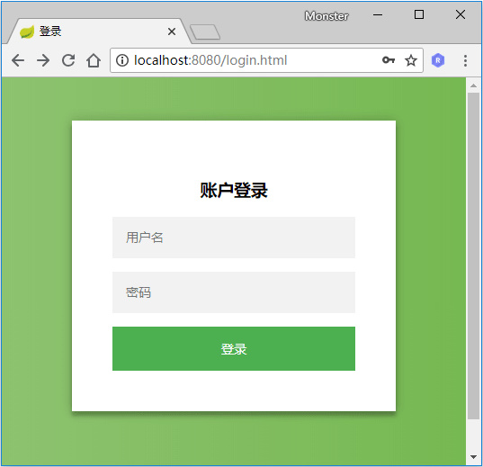
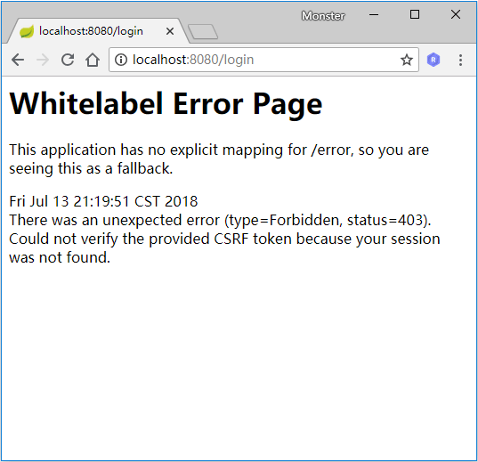
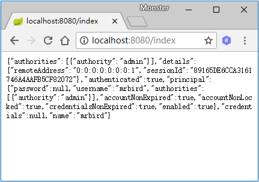
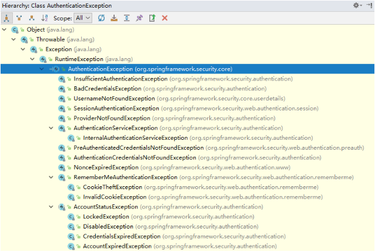
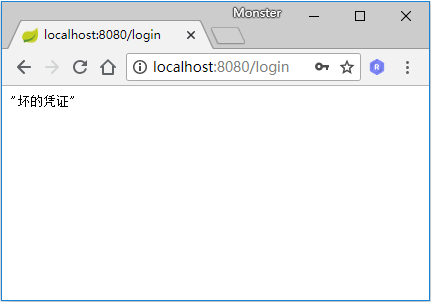

# Spring Security自定义用户认证
在Spring Boot中开启Spring Security一节中我们简单搭建了个Spring Boot + Spring Security的项目，认证的用户名和密码都是由Spring Security生成。Spring Security支持我们自定义认证的过程，如处理用户信息获取逻辑，使用我们自定义的登录页面替换Spring Security默认的登录页及自定义登录成功或失败后的处理逻辑等。这里将在上一节的源码基础上进行改造。
# 自定义认证过程
自定义认证的过程需要实现Spring Security提供的UserDetailService接口，该接口只有一个抽象方法loadUserByUsername，源码如下：
```java
public interface UserDetailsService {
    UserDetails loadUserByUsername(String username) throws UsernameNotFoundException;
}
```
loadUserByUsername方法返回一个UserDetail对象，该对象也是一个接口，包含一些用于描述用户信息的方法，源码如下：
```java
public interface UserDetails extends Serializable {
    Collection<? extends GrantedAuthority> getAuthorities();

    String getPassword();

    String getUsername();

    boolean isAccountNonExpired();

    boolean isAccountNonLocked();

    boolean isCredentialsNonExpired();

    boolean isEnabled();
}
```
这些方法的含义如下：
- getAuthorities获取用户包含的权限，返回权限集合，权限是一个继承了GrantedAuthority的对象；
- getPassword和getUsername用于获取密码和用户名；
- isAccountNonExpired方法返回boolean类型，用于判断账户是否未过期，未过期返回true反之返回false；
- isAccountNonLocked方法用于判断账户是否未锁定；
- isCredentialsNonExpired用于判断用户凭证是否没过期，即密码是否未过期；
- isEnabled方法用于判断用户是否可用。

实际中我们可以自定义UserDetails接口的实现类，也可以直接使用Spring Security提供的UserDetails接口实现类org.springframework.security.core.userdetails.User。

说了那么多，下面我们来开始实现UserDetailService接口的loadUserByUsername方法。

首先创建一个MyUser对象，用于存放模拟的用户数据（实际中一般从数据库获取，这里为了方便直接模拟）：
```java
public class MyUser implements Serializable {
    private static final long serialVersionUID = 3497935890426858541L;

    private String username;
    private String password;
    private boolean accountNonExpired = true;
    private boolean accountNonLocked = true;
    private boolean credentialsNonExpired = true;
    private boolean enabled = true;

    // get,set略
}
```
接着创建MyUserDetailService实现UserDetailService：
```java
@Configuration
public class UserDetailService implements UserDetailsService {

    @Autowired
    private PasswordEncoder passwordEncoder;

    @Override
    public UserDetails loadUserByUsername(String username) throws UsernameNotFoundException {
        // 模拟一个用户,替代数据库获取逻辑
        MyUser user = new MyUser();
        user.setUsername(username);
        user.setPassword(this.passwordEncoder.encode("123456"));
        // 输出加密后的密码
        System.out.println(user.getPassword());
        return new User(username, user.getPassword(), user.isEnabled(),
                user.isAccountNonExpired(), user.isCredentialsNonExpired(),
                user.isAccountNonLocked(), AuthorityUtils.commaSeparatedStringToAuthorityList("admin"));
    }
}
```
这里我们使用了org.springframework.security.core.userdetails.User类包含7个参数的构造器，其还包含一个三个参数的构造器User(String username, String password,Collection<? extends GrantedAuthority> authorities)，由于权限参数不能为空，所以这里先使用AuthorityUtils.commaSeparatedStringToAuthorityList方法模拟一个admin的权限，该方法可以将逗号分隔的字符串转换为权限集合。

此外我们还注入了PasswordEncoder对象，该对象用于密码加密，注入前需要手动配置。我们在BrowserSecurityConfig中配置它：
```java
@Configuration
public class BrowserSecurityConfig extends WebSecurityConfigurerAdapter {

    @Bean
    public PasswordEncoder passwordEncoder(){
        return new BCryptPasswordEncoder();
    }
    ...
}
```
PasswordEncoder是一个密码加密接口，而BCryptPasswordEncoder是Spring Security提供的一个实现方法，我们也可以自己实现PasswordEncoder。不过Spring Security实现的BCryptPasswordEncoder已经足够强大，它对相同的密码进行加密后可以生成不同的结果。

这时候重启项目，访问http://localhost:8080/login，便可以使用任意用户名以及123456作为密码登录系统。我们多次进行登录操作，可以看到控制台输出的加密后的密码如下：
```java
$2a$10$muHmbrTkUg4otsN/Mk1wce4QJQJafjBQA68PqfzL3rxWtbbaFiDZC
$2a$10$NkHgrjSRWL7gjkESyZ/Z.e7mD3VMhQM98qiw6YviPTw152XgNTia6
$2a$10$Oysb05KDGTORB/G/EelyQuPmDdHp.EqlYJQEWWmslMH44dKoyHZNu
```
可以看到，BCryptPasswordEncoder对相同的密码生成的结果每次都是不一样的。
# 替换默认登录页
默认的登陆页面过于简陋,我们可以自己定义一个登录页面。为了方便起见，我们直接在src/main/resources/resources目录下定义一个login.html（不需要Controller跳转）：
```html
<!DOCTYPE html>
<html>
<head>
    <meta charset="UTF-8">
    <title>登录</title>
    <link rel="stylesheet" href="css/login.css" type="text/css">
</head>
<body>
<form class="login-page" action="/login" method="post">
    <div class="form">
        <h3>账户登录</h3>
        <input type="text" placeholder="用户名" name="username" required="required"/>
        <input type="password" placeholder="密码" name="password" required="required"/>
        <button type="submit">登录</button>
    </div>
</form>
</body>
</html>
```
要怎么做才能让Spring Security跳转到我们自己定义的登录页面呢？很简单，只需要在BrowserSecurityConfig的configure中添加一些配置：
```java
@Override
protected void configure(HttpSecurity http) throws Exception {
    http.formLogin() // 表单登录
        // http.httpBasic() // HTTP Basic
        .loginPage("/login.html")
        .loginProcessingUrl("/login")
        .and()
        .authorizeRequests() // 授权配置
        .antMatchers("/login.html").permitAll()
        .anyRequest()  // 所有请求
        .authenticated(); // 都需要认证
}
```
上面代码中.loginPage("/login.html")指定了跳转到登录页面的请求URL，.loginProcessingUrl("/login")对应登录页面form表单的action="/login"，.antMatchers("/login.html").permitAll()表示跳转到登录页面的请求不被拦截，否则会进入无限循环。

这时候启动系统，访问http://localhost:8080/hello，会看到页面已经被重定向到了http://localhost:8080/login.html：



输入用户名和密码发现页面报错：



我们先把CSRF攻击防御关了，修改BrowserSecurityConfig的configure：
```java
Override
protected void configure(HttpSecurity http) throws Exception {
    http.formLogin() // 表单登录
        // http.httpBasic() // HTTP Basic
        .loginPage("/login.html") // 登录跳转 URL
        .loginProcessingUrl("/login") // 处理表单登录 URL
        .and()
        .authorizeRequests() // 授权配置
        .antMatchers("/login.html").permitAll() // 登录跳转 URL 无需认证
        .anyRequest()  // 所有请求
        .authenticated() // 都需要认证
        .and().csrf().disable();
}
```
重启项目便可正常登录。

假如现在有这样一个需求：在未登录的情况下，当用户访问html资源的时候跳转到登录页，否则返回JSON格式数据，状态码为401。

要实现这个功能我们将loginPage的URL改为/authentication/require，并且在antMatchers方法中加入该URL，让其免拦截:
```java
@Override
protected void configure(HttpSecurity http) throws Exception {
    http.formLogin() // 表单登录
        // http.httpBasic() // HTTP Basic
        .loginPage("/authentication/require") // 登录跳转 URL
        .loginProcessingUrl("/login") // 处理表单登录 URL
        .and()
        .authorizeRequests() // 授权配置
        .antMatchers("/authentication/require", "/login.html").permitAll() // 登录跳转 URL 无需认证
        .anyRequest()  // 所有请求
        .authenticated() // 都需要认证
        .and().csrf().disable();
}
```
然后定义一个控制器BrowserSecurityController，处理这个请求：
```java
@RestController
public class BrowserSecurityController {
    private RequestCache requestCache = new HttpSessionRequestCache();
    private RedirectStrategy redirectStrategy = new DefaultRedirectStrategy();

    @GetMapping("/authentication/require")
    @ResponseStatus(HttpStatus.UNAUTHORIZED)
    public String requireAuthentication(HttpServletRequest request, HttpServletResponse response) throws IOException {
        SavedRequest savedRequest = requestCache.getRequest(request, response);
        if (savedRequest != null) {
            String targetUrl = savedRequest.getRedirectUrl();
            if (StringUtils.endsWithIgnoreCase(targetUrl, ".html"))
                redirectStrategy.sendRedirect(request, response, "/login.html");
        }
        return "访问的资源需要身份认证！";
    }
}
```
其中HttpSessionRequestCache为Spring Security提供的用于缓存请求的对象，通过调用它的getRequest方法可以获取到本次请求的HTTP信息。DefaultRedirectStrategy的sendRedirect为Spring Security提供的用于处理重定向的方法。

上面代码获取了引发跳转的请求，根据请求是否以.html为结尾来对应不同的处理方法。如果是以.html结尾，那么重定向到登录页面，否则返回”访问的资源需要身份认证！”信息，并且HTTP状态码为401（HttpStatus.UNAUTHORIZED）。

这样当我们访问http://localhost:8080/hello的时候页面便会跳转到http://localhost:8080/authentication/require，并且输出”访问的资源需要身份认证！”，当我们访问http://localhost:8080/hello.html的时候，页面将会跳转到登录页面。
# 处理成功和失败
Spring Security有一套默认的处理登录成功和失败的方法：当用户登录成功时，页面会跳转会引发登录的请求，比如在未登录的情况下访问http://localhost:8080/hello，页面会跳转到登录页，登录成功后再跳转回来；登录失败时则是跳转到Spring Security默认的错误提示页面。下面我们通过一些自定义配置来替换这套默认的处理机制。
## 自定义登陆成功逻辑
要改变默认的处理成功逻辑很简单，只需要实现org.springframework.security.web.authentication.AuthenticationSuccessHandler接口的onAuthenticationSuccess方法即可：
```java
@Component
public class MyAuthenticationSucessHandler implements AuthenticationSuccessHandler {
    @Override
    public void onAuthenticationSuccess(HttpServletRequest request, HttpServletResponse response,
                                        Authentication authentication) throws IOException, ServletException {
        response.setContentType("application/json;charset=utf-8");
        response.getWriter().write(mapper.writeValueAsString(authentication));
    }
}
```
其中Authentication参数既包含了认证请求的一些信息，比如IP，请求的SessionId等，也包含了用户信息，即前面提到的User对象。通过上面这个配置，用户登录成功后页面将打印出Authentication对象的信息。

要使这个配置生效，我们还的在BrowserSecurityConfig的configure中配置它：
```java
@Configuration
public class BrowserSecurityConfig extends WebSecurityConfigurerAdapter {
    @Autowired
    private MyAuthenticationSucessHandler authenticationSucessHandler;

    @Bean
    public PasswordEncoder passwordEncoder() {
        return new BCryptPasswordEncoder();
    }

    @Override
    protected void configure(HttpSecurity http) throws Exception {
        http.formLogin() // 表单登录
                // http.httpBasic() // HTTP Basic
                .loginPage("/authentication/require") // 登录跳转 URL
                .loginProcessingUrl("/login") // 处理表单登录 URL
                .successHandler(authenticationSucessHandler) // 处理登录成功
                .and()
                .authorizeRequests() // 授权配置
                .antMatchers("/authentication/require", "/login.html").permitAll() // 登录跳转 URL 无需认证
                .anyRequest()  // 所有请求
                .authenticated() // 都需要认证
                .and().csrf().disable();
    }
}
```
我们将MyAuthenticationSucessHandler注入进来，并通过successHandler方法进行配置。

这时候重启项目登录后页面将会输出如下JSON信息：
```json
{
  "authorities": [
    {
      "authority": "admin"
    }
  ],
  "details": {
    "remoteAddress": "0:0:0:0:0:0:0:1",
    "sessionId": "8D50BAF811891F4397E21B4B537F0544"
  },
  "authenticated": true,
  "principal": {
    "password": null,
    "username": "mrbird",
    "authorities": [
      {
        "authority": "admin"
      }
    ],
    "accountNonExpired": true,
    "accountNonLocked": true,
    "credentialsNonExpired": true,
    "enabled": true
  },
  "credentials": null,
  "name": "mrbird"
}
```
像password，credentials这些敏感信息，Spring Security已经将其屏蔽。

除此之外，我们也可以在登录成功后做页面的跳转，修改MyAuthenticationSucessHandler：
```java
@Component
public class MyAuthenticationSucessHandler implements AuthenticationSuccessHandler {
    private RequestCache requestCache = new HttpSessionRequestCache();
    private RedirectStrategy redirectStrategy = new DefaultRedirectStrategy();

    @Autowired
    private ObjectMapper mapper;

    @Override
    public void onAuthenticationSuccess(HttpServletRequest request, HttpServletResponse response,
                                        Authentication authentication) throws IOException {
        SavedRequest savedRequest = requestCache.getRequest(request, response);
        redirectStrategy.sendRedirect(request, response, savedRequest.getRedirectUrl());
    }
}
```
通过上面配置，登录成功后页面将跳转回引发跳转的页面。如果想指定跳转的页面，比如跳转到/index，可以将savedRequest.getRedirectUrl()修改为/index：
```java
@Component
public class MyAuthenticationSucessHandler implements AuthenticationSuccessHandler {
    private RedirectStrategy redirectStrategy = new DefaultRedirectStrategy();

    @Override
    public void onAuthenticationSuccess(HttpServletRequest request, HttpServletResponse response,
                                        Authentication authentication) throws IOException {
        redirectStrategy.sendRedirect(request, response, "/index");
    }
}
```
然后在TestController中定义一个处理该请求的方法：
```java
@RestController
public class TestController {
    @GetMapping("index")
    public Object index(){
        return SecurityContextHolder.getContext().getAuthentication();
    }
}
```
登录成功后，便可以使用SecurityContextHolder.getContext().getAuthentication()获取到Authentication对象信息。除了通过这种方式获取Authentication对象信息外，也可以使用下面这种方式:
```java
@RestController
public class TestController {
    @GetMapping("index")
    public Object index(Authentication authentication) {
        return authentication;
    }
}
```
重启项目，登录成功后，页面将跳转到http://localhost:8080/index：



## 自定义登陆失败逻辑
和自定义登录成功处理逻辑类似，自定义登录失败处理逻辑需要实现org.springframework.security.web.authentication.AuthenticationFailureHandler的onAuthenticationFailure方法：
```java
@Component
public class MyAuthenticationFailureHandler implements AuthenticationFailureHandler {
    @Override
    public void onAuthenticationFailure(HttpServletRequest request, HttpServletResponse response,
                                        AuthenticationException exception) throws IOException {
    }
}
```
onAuthenticationFailure方法的AuthenticationException参数是一个抽象类，Spring Security根据登录失败的原因封装了许多对应的实现类，查看AuthenticationException的Hierarchy：



不同的失败原因对应不同的异常，比如用户名或密码错误对应的是BadCredentialsException，用户不存在对应的是UsernameNotFoundException，用户被锁定对应的是LockedException等。

假如我们需要在登录失败的时候返回失败信息，可以这样处理：
```java
@Component
public class MyAuthenticationFailureHandler implements AuthenticationFailureHandler {

    @Autowired
    private ObjectMapper mapper;

    @Override
    public void onAuthenticationFailure(HttpServletRequest request, HttpServletResponse response,
                                        AuthenticationException exception) throws IOException {
        response.setStatus(HttpStatus.INTERNAL_SERVER_ERROR.value());
        response.setContentType("application/json;charset=utf-8");
        response.getWriter().write(mapper.writeValueAsString(exception.getMessage()));
    }
}
```
状态码定义为500（HttpStatus.INTERNAL_SERVER_ERROR.value()），即系统内部异常。

同样的，我们需要在BrowserSecurityConfig的configure中配置它：
```java
@Configuration
public class BrowserSecurityConfig extends WebSecurityConfigurerAdapter {
    @Autowired
    private MyAuthenticationSucessHandler authenticationSucessHandler;

    @Autowired
    private MyAuthenticationFailureHandler authenticationFailureHandler;

    @Override
    protected void configure(HttpSecurity http) throws Exception {
        http.formLogin() // 表单登录
                // http.httpBasic() // HTTP Basic
                .loginPage("/authentication/require") // 登录跳转 URL
                .loginProcessingUrl("/login") // 处理表单登录 URL
                .successHandler(authenticationSucessHandler) // 处理登录成功
                .failureHandler(authenticationFailureHandler) // 处理登录失败
                .and()
                .authorizeRequests() // 授权配置
                .antMatchers("/authentication/require", "/login.html").permitAll() // 登录跳转 URL 无需认证
                .anyRequest()  // 所有请求
                .authenticated() // 都需要认证
                .and().csrf().disable();
    }
}
```
重启项目，当输入错误的密码时，页面输出如下：



源码链接：https://github.com/wuyouzhuguli/SpringAll/tree/master/35.Spring-Security-Authentication
