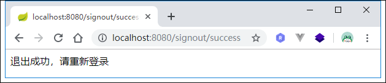
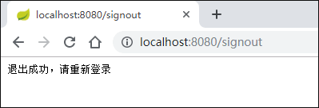

# Spring Security退出登录
Spring Security默认的退出登录URL为`/logout`，退出登录后，Spring Security会做如下处理：
1. 是当前的Sesion失效；
2. 清除与当前用户关联的RememberMe记录；
3. 清空当前的SecurityContext；
4. 重定向到登录页。

Spring Security允许我们通过配置来更改上面这些默认行为。

# 自定义退出登录行为
我们在Spring Security配置中添加如下配置:
```java
......
.and()
    .logout()
    .logoutUrl("/signout")
    .logoutSuccessUrl("/signout/success")
    .deleteCookies("JSESSIONID")
.and()
......
```
上面配置了退出登录的URL为`/signout`，退出成功后跳转的URL为`/signout/success`，退出成功后删除名称为`JSESSIONID`的cookie。

在Controller中添加和`/signout/success`对应的方法：
```java
@GetMapping("/signout/success")
public String signout() {
    return "退出成功，请重新登陆";
}
```
接着将/signout/success添加到免认证路径里。启动项目，登录后访问/signout：



可看到退出成功，并且请求重定向到了`/signout/success`。

除了指定`logoutUrl`外，我们也可以通过`logoutSuccessHandler`指定退出成功处理器来处理退出成功后的逻辑：
```java
@Autowired
private MyLogOutSuccessHandler logOutSuccessHandler;

......
.and()
    .logout()
    .logoutUrl("/signout")
    //.logoutSuccessUrl("/signout/success")
    .logoutSuccessHandler(logOutSuccessHandler)
    .deleteCookies("JSESSIONID")
.and()
......
```
`MyLogOutSuccessHandler`实现`LogoutSuccessHandler`：
```java
@Component
public class MyLogOutSuccessHandler implements LogoutSuccessHandler {
    @Override
    public void onLogoutSuccess(HttpServletRequest httpServletRequest, HttpServletResponse httpServletResponse, Authentication authentication) throws IOException, ServletException {
        httpServletResponse.setStatus(HttpStatus.UNAUTHORIZED.value());
        httpServletResponse.setContentType("application/json;charset=utf-8");
        httpServletResponse.getWriter().write("退出成功，请重新登录");
    }
}
```

效果和上面一样：



源码链接：https://github.com/wuyouzhuguli/SpringAll/tree/master/60.Spring-Security-Logout


