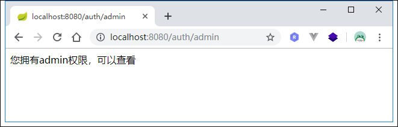
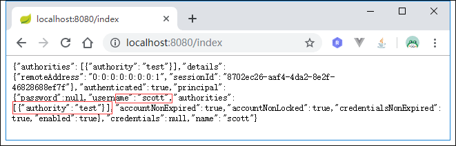
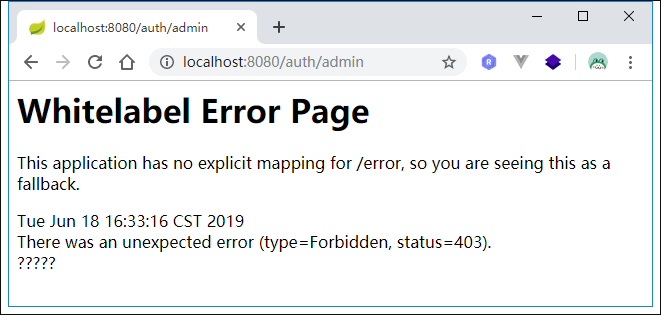
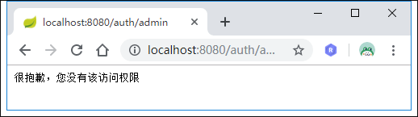

# Spring Security权限控制
Spring Security权限控制可以配合授权注解使用，具体有哪些注解可以参考Spring-Security保护方法。接着上一节，要开启这些注解，只需要在Spring Security配置文件中添加如下注解：
```java
@Configuration
@EnableGlobalMethodSecurity(prePostEnabled = true)
public class BrowserSecurityConfig extends WebSecurityConfigurerAdapter {
    ...
}
```
在`UserDetailService`中，我们给当前登录用户授予了”admin”的权限，我们将这块代码改造一下：当登录用户为mrbird的时候，其拥有”admin”权限，其他用户则只有”test”权限：
```java
@Configuration
public class UserDetailService implements UserDetailsService {

    @Autowired
    private PasswordEncoder passwordEncoder;

    @Override
    public UserDetails loadUserByUsername(String username) throws UsernameNotFoundException {
        // 模拟一个用户，替代数据库获取逻辑
        MyUser user = new MyUser();
        user.setUsername(username);
        user.setPassword(this.passwordEncoder.encode("123456"));
        // 输出加密后的密码
        System.out.println(user.getPassword());

        List<GrantedAuthority> authorities = new ArrayList<>();
        if (StringUtils.equalsIgnoreCase("mrbird", username)) {
            authorities = AuthorityUtils.commaSeparatedStringToAuthorityList("admin");
        } else {
            authorities = AuthorityUtils.commaSeparatedStringToAuthorityList("test");
        }

        return new User(username, user.getPassword(), user.isEnabled(),
                user.isAccountNonExpired(), user.isCredentialsNonExpired(),
                user.isAccountNonLocked(), authorities);
    }
}
```
添加一个方法，并且使用权限注解标明只有拥有“admin”权限的人才能访问：
```java
@GetMapping("/auth/admin")
@PreAuthorize("hasAuthority('admin')")
public String authenticationTest() {
    return "您拥有admin权限，可以查看";
}
```
启动系统，使用mrbird账号登录：




可看到，mrbird可以访问该资源。

使用scott账号登录：





可以看到，soctt没有权限访问，返回403错误码。

我们可以自定义权限不足处理器来处理权限不足时候的操作。

新增一个处理器`MyAuthenticationAccessDeniedHandler`，实现`AccessDeniedHandler`接口：
```java
@Component
public class MyAuthenticationAccessDeniedHandler implements AccessDeniedHandler {
    @Override
    public void handle(HttpServletRequest request, HttpServletResponse response, AccessDeniedException accessDeniedException) throws IOException, ServletException {
        response.setStatus(HttpStatus.INTERNAL_SERVER_ERROR.value());
        response.setContentType("application/json;charset=utf-8");
        response.getWriter().write("很抱歉，您没有该访问权限");
    }
}
```

然后将这个处理器添加到Spring Security配置链中:

```java
@Autowired
private MyAuthenticationAccessDeniedHandler authenticationAccessDeniedHandler;

@Override
protected void configure(HttpSecurity http) throws Exception {
    http.exceptionHandling()
        .accessDeniedHandler(authenticationAccessDeniedHandler) // 自定义权限不足处理器来处理权限不足时候的操作
        .and()
    ......
}
```
重启系统，再次使用scott账号访问/auth/admin：



源码链接：https://github.com/wuyouzhuguli/SpringAll/tree/master/61.Spring-security-Permission


