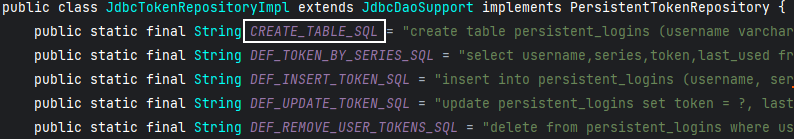
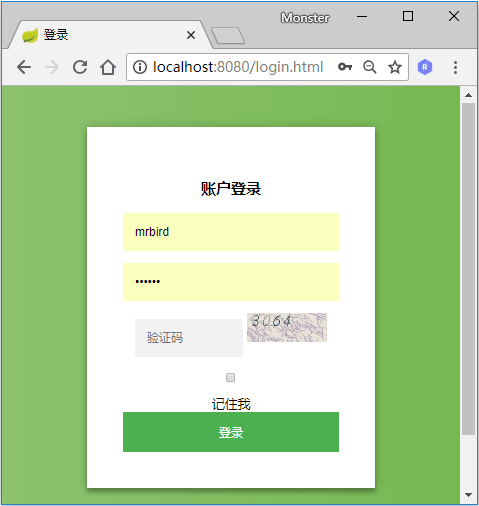
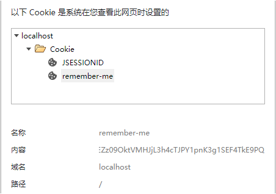
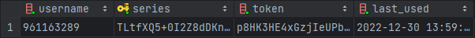

# Spring Security 添加记住我功能
在网站的登录页面中，记住我选项是一个很常见的功能，勾选记住我后在一段时间内，用户无需进行登录操作就可以访问系统资源。在Spring Security中添加记住我功能很简单，大致过程是：当用户勾选了记住我选项并登录成功后，Spring Security会生成一个token标识，然后将该token标识持久化到数据库，并且生成一个与该token相对应的cookie返回给浏览器。当用户过段时间再次访问系统时，如果该cookie没有过期，Spring Security便会根据cookie包含的信息从数据库中获取相应的token信息，然后帮用户自动完成登录操作。
# token持久化
Spring Security的记住我功能的实现需要使用数据库来持久化token。我们在上一节Spring Security添加图形验证码的基础上来添加记住我的功能。

在application.yml中添加数据源配置：
```yaml
spring:
  datasource:
    driver-class-name: com.mysql.jdbc.Driver
    url: jdbc:mysql://127.0.0.1:3306/springboot_db?useUnicode=yes&characterEncoding=UTF-8&useSSL=false
    username: root
    password: root
```
添加数据库依赖
```xml
<dependency>
    <groupId>org.springframework.boot</groupId>
    <artifactId>spring-boot-starter-jdbc</artifactId>
</dependency>
<dependency>
    <groupId>mysql</groupId>
    <artifactId>mysql-connector-java</artifactId>
</dependency>
```
然后我们在BrowserSecurityConfig中配置个token持久化对象：
```java
@Configuration
public class BrowserSecurityConfig extends WebSecurityConfigurerAdapter {

    @Autowired
    private UserDetailService userDetailService;
    @Autowired
    private DataSource dataSource;

    @Bean
    public PersistentTokenRepository persistentTokenRepository() {
        JdbcTokenRepositoryImpl jdbcTokenRepository = new JdbcTokenRepositoryImpl();
        jdbcTokenRepository.setDataSource(dataSource);
        jdbcTokenRepository.setCreateTableOnStartup(false);
        return jdbcTokenRepository;
    }
    ...
}
```
PersistentTokenRepository为一个接口类，这里我们用的是数据库持久化，所以实例用的是PersistentTokenRepository的实现类JdbcTokenRepositoryImpl。

JdbcTokenRepositoryImpl需要指定数据源，所以我们将配置好的数据源对象DataSource注入进来并配置到JdbcTokenRepositoryImpl的dataSource属性中。createTableOnStartup属性用于是否启动项目时创建保存token信息的数据表，这里设置为false，我们自己手动创建。

查看JdbcTokenRepositoryImpl的源码，可以看到其包含了一个CREATE_TABLE_SQL属性：



这个其实就是用于保存token对象数据表的SQL语句，我们复制出来手动执行创建表：
```sql
CREATE TABLE persistent_logins (
    username  VARCHAR(64) NOT NULL,
    series    VARCHAR(64) PRIMARY KEY,
    token     VARCHAR(64) NOT NULL,
    last_used TIMESTAMP   NOT NULL
)
```
# 修改登录页
完成上述配置后，我们稍微改造下登录页，加入记住我的勾选选项：
```html
<input type="checkbox" name="remember-me"> 记住我
```
其中name属性必须为remember-me。
# 配置生效
最后我们需要在Spring Security的认证流程中启用记住我的功能，在BrowserSecurityConfig的configure方法中开启记住我功能：
```java
@Override
protected void configure(HttpSecurity http) throws Exception {
    http.addFilterBefore(validateCodeFilter, UsernamePasswordAuthenticationFilter.class) // 添加验证码校验过滤器
            .formLogin() // 表单登录
            // http.httpBasic() // HTTP Basic
            .loginPage("/authentication/require") // 登录跳转 URL
            .loginProcessingUrl("/login") // 处理表单登录 URL
            .successHandler(authenticationSucessHandler) // 处理登录成功
            .failureHandler(authenticationFailureHandler) // 处理登录失败
            .and()
            .rememberMe()
            .tokenRepository(persistentTokenRepository()) // 配置 token 持久化仓库
            .tokenValiditySeconds(3600) // remember 过期时间，单为秒
            .userDetailsService(userDetailService) // 处理自动登录逻辑
            .and()
            .authorizeRequests() // 授权配置
            .antMatchers("/authentication/require",
                    "/login.html",
                    "/code/image").permitAll() // 无需认证的请求路径
            .anyRequest()  // 所有请求
            .authenticated() // 都需要认证
            .and()
            .csrf().disable();
}
```
rememberMe()用于开启记住我功能；
tokenRepository(persistentTokenRepository())用于指定token持久化方法；
tokenValiditySeconds配置了token的有效时长，单为为秒；
userDetailsService(userDetailService)用于处理通过token对象自动登录，这里为我们自定义的UserDetailsService接口实现。
配置好后，重启项目，登录页面如下所示：



比较难看，无伤大雅。勾选并成功登录后，可以看到网页多了个remember-me的cookie对象：



查看数据库表persistent_logins：



可以看到token信息已经成功持久化了，并且浏览器也成功生成了相应的cookie。在cookie未失效之前，无论是重开浏览器或者重启项目，用户都无需再次登录就可以访问系统资源了。

源码链接 https://github.com/wuyouzhuguli/SpringAll/tree/master/37.Spring-Security-RememberMe


