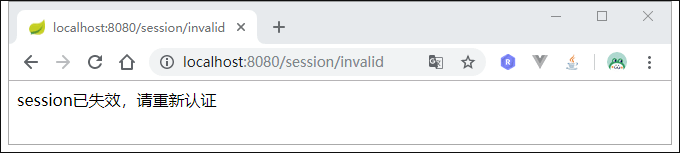
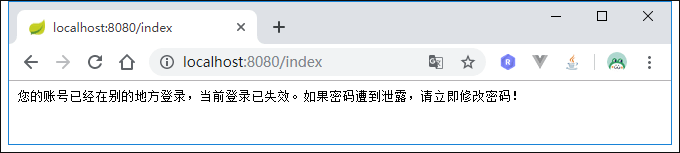
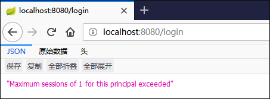
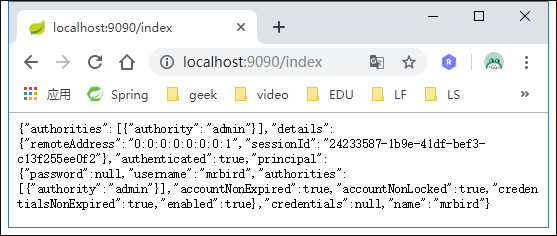

# Spring Security Session管理
用户登录成功后，信息保存在服务器Session中，这节学习下如何管理这些Session。这节将在Spring Security短信验证码登录的基础上继续扩展。

# Session 超时设置
Session超时时间也就是用户登录的有效时间。要设置Session超时时间很简单，只需要在配置文件中添加：
```yaml
server:
  reactive:
    session:
      timeout: 3600
```
单位为秒，通过上面的配置，Session的有效期为一个小时。

值得注意的是，Session的最小有效期为60秒，也就是说即使你设置为小于60秒的值，其有效期还是为60秒。查看`TomcatEmbeddedServletContainerFactory`的源码即可发现原因：
```java
private long getSessionTimeoutInMinutes() {
    Duration sessionTimeout = this.getSession().getTimeout();
    return this.isZeroOrLess(sessionTimeout) ? 0L : Math.max(sessionTimeout.toMinutes(), 1L);
}
```
Session失效后，刷新页面后将跳转到认证页面，我们可以再添加一些配置，自定义Session失效后的一些行为。

在Spring Security中配置Session管理器，并配置Session失效后要跳转的URL：

```java
@Override
protected void configure(HttpSecurity http) throws Exception {
    http.addFilterBefore(validateCodeFilter, UsernamePasswordAuthenticationFilter.class) // 添加验证码校验过滤器
            .addFilterBefore(smsCodeFilter, UsernamePasswordAuthenticationFilter.class) // 添加短信验证码校验过滤器
            .formLogin() // 表单登录
            // http.httpBasic() // HTTP Basic
            .loginPage("/authentication/require") // 登录跳转 URL
            .loginProcessingUrl("/login") // 处理表单登录 URL
            .successHandler(authenticationSucessHandler) // 处理登录成功
            .failureHandler(authenticationFailureHandler) // 处理登录失败
            .and()
            .authorizeRequests() // 授权配置
            .antMatchers("/authentication/require",
                    "/login.html",
                    "/code/image",
                    "/code/sms",
                    "/session/invalid").permitAll() // 无需认证的请求路径
            .anyRequest()  // 所有请求
            .authenticated() // 都需要认证
            .and()
            .sessionManagement() // 添加 Session 管理器
            .invalidSessionUrl("/session/invalid") // Session 失效后跳转到这个链接
        ......
}
```
上面配置了Session失效后跳转到`/session/invalid`，并且将这个URL添加到了免认证路径中。

在Controller里添加一个方法，映射该请求：

```java
@GetMapping("/session/invalid")
@ResponseStatus(HttpStatus.UNAUTHORIZED)
public String sessionInvalid() {
    return "session已失效，请重新认证";
}
```
为了演示，我们将Session的超时时间设置为最小值60秒，重启项目，认证后等待60秒并刷新页面：



可看到请求跳转到了我们自定义的`/session/invalid`URL上。

# Session并发控制
Session并发控制可以控制一个账号同一时刻最多能登录多少个。我们在Spring Security配置中继续添加Session相关配置:
```java
@Override
protected void configure(HttpSecurity http) throws Exception {
    http.addFilterBefore(validateCodeFilter, UsernamePasswordAuthenticationFilter.class) // 添加验证码校验过滤器
            .addFilterBefore(smsCodeFilter, UsernamePasswordAuthenticationFilter.class) // 添加短信验证码校验过滤器
            .formLogin() // 表单登录
            // http.httpBasic() // HTTP Basic
            .loginPage("/authentication/require") // 登录跳转 URL
            .loginProcessingUrl("/login") // 处理表单登录 URL
            .successHandler(authenticationSucessHandler) // 处理登录成功
            .failureHandler(authenticationFailureHandler) // 处理登录失败
            .and()
            .authorizeRequests() // 授权配置
            .antMatchers("/authentication/require",
                    "/login.html",
                    "/code/image",
                    "/code/sms",
                    "/session/invalid").permitAll() // 无需认证的请求路径
            .anyRequest()  // 所有请求
            .authenticated() // 都需要认证
            .and()
            .sessionManagement() // 添加 Session 管理器
            .invalidSessionUrl("/session/invalid") // Session 失效后跳转到这个链接
            .maximumSessions(1) // 配置最大Session并发数量为1个
            .maxSessionsPreventsLogin(true) // 控制当 Session 达到最大有效数的时候,不再允许相同的账户登陆
            .expiredSessionStrategy(sessionExpiredStrategy) // 配置 Session 在并发失效后的处理策略
            .and()
        ......
}
```
`maximumSessions`配置了最大Session并发数量为1个，如果mrbird这个账户登录后，在另一个客户端也使用mrbird账户登录，那么第一个使用mrbird登录的账户将会失效，类似于一个先入先出队列。`expiredSessionStrategy`配置了Session在并发下失效后的处理策略，这里为我们自定义的策略`MySessionExpiredStrategy`。

`MySessionExpiredStrategy`实现`SessionInformationExpiredStrategy`：
```java
@Component
public class MySessionExpiredStrategy implements SessionInformationExpiredStrategy {
    @Override
    public void onExpiredSessionDetected(SessionInformationExpiredEvent event) throws IOException, ServletException {
        HttpServletResponse response = event.getResponse();
        response.setStatus(HttpStatus.UNAUTHORIZED.value());
        response.setContentType("application/json;charset=utf-8");
        response.getWriter().write("您的账号已经在别的地方登录，当前登录已失效。如果密码遭到泄露，请立即修改密码！");
    }
}
```
为了演示这个效果，我们先将Session超时时间设置久一点，比如3600秒，然后重启项目，在Chrome里使用mrbird账户登录。

登录成功后，在firefox上也是用mrbird账户登录，登录成功后回到chrome，刷新页面，效果如下所示：



除了后者将前者踢出的策略，我们也可以控制当Session达到最大有效数的时候，不再允许相同的账户登录。

要实现这个功能只需要在上面的配置中添加：

```java
......
.and()
    .sessionManagement() // 添加 Session 管理器
    .invalidSessionUrl("/session/invalid") // Session 失效后跳转到这个链接
    .maximumSessions(1) // 配置最大Session并发数量为1个
    .maxSessionsPreventsLogin(true) // 控制当 Session 达到最大有效数的时候,不再允许相同的账户登陆
    .expiredSessionStrategy(sessionExpiredStrategy) // 配置 Session 在并发失效后的处理策略
    .and()
......
```
重启系统，在chrome上登录mrbird账户后，在firefox上尝试使用mrbird账户登录：



可以看到登录受限。

> 在实际开发中，发现Session并发控制只对Spring Security默认的登录方式——账号密码登录有效，而像短信验证码登录，社交账号登录并不生效，解决方案可以参考我的开源项目https://github.com/wuyouzhuguli/FEBS-Security

# Session集群处理
Session集群听着高大上，其实实现起来很简单。当我们登录成功后，用户认证的信息存储在Session中，而这些Session默认是存储在运行运用的服务器上的，比如Tomcat，netty等。当应用集群部署的时候，用户在A应用上登录认证了，后续通过负载均衡可能会把请求发送到B应用，而B应用服务器上并没有与该请求匹配的认证Session信息，所以用户就需要重新进行认证。要解决这个问题，我们可以把Session信息存储在第三方容器里（如Redis集群），而不是各自的服务器，这样应用集群就可以通过第三方容器来共享Session了。

我们引入Redis和Spring Session依赖：

```xml
<!-- https://mvnrepository.com/artifact/org.springframework.session/spring-session -->
<dependency>
    <groupId>org.springframework.session</groupId>
    <artifactId>spring-session</artifactId>
    <version>1.3.5.RELEASE</version>
</dependency>

<!-- https://mvnrepository.com/artifact/org.springframework.boot/spring-boot-starter-data-redis -->
<dependency>
    <groupId>org.springframework.boot</groupId>
    <artifactId>spring-boot-starter-data-redis</artifactId>
    <version>3.0.0</version>
</dependency>
```
然后在yml中配置Session存储方式为Redis：
```yaml
spring:
  session:
    store-type: redis
```
为了方便，Redis配置采用默认配置即可。

开启Redis，并且启动两个应用实例，一个端口为8080，另一个端口为9090。

我们现在8080端口应用上登录：


然后访问9090端口应用的主页：



可以看到登录也是生效的。这就实现了集群化Session管理。

# 其他操作
`SessionRegistry`包含了一些使用的操作Session的方法，比如：
1. 踢出用户（让Session失效）：
```java
String currentSessionId = request.getRequestedSessionId();
sessionRegistry.getSessionInformation(sessionId).expireNow();
```
2. 获取所有Session信息：
```java
List<Object> principals = sessionRegistry.getAllPrincipals();
```

源码链接：https://github.com/wuyouzhuguli/SpringAll/tree/master/59.Spring-Security-SessionManager

