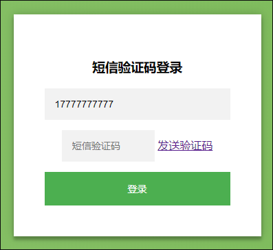
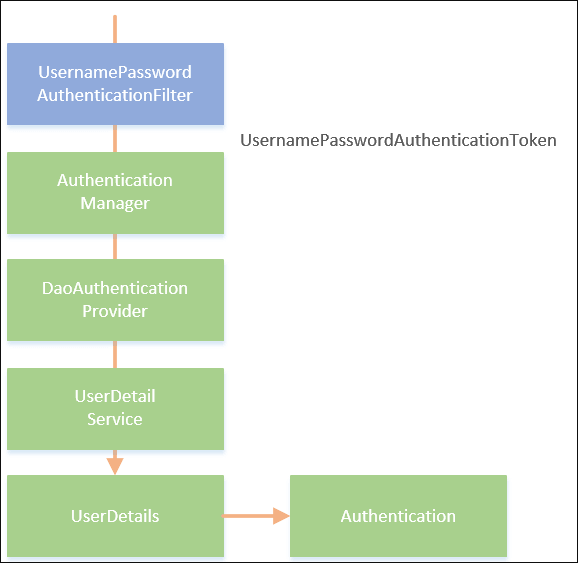
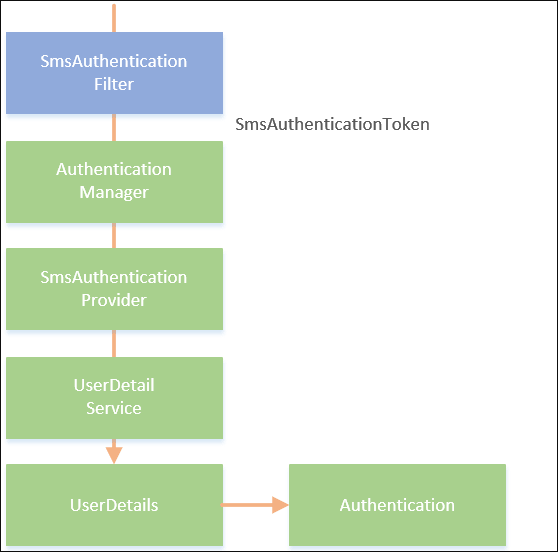
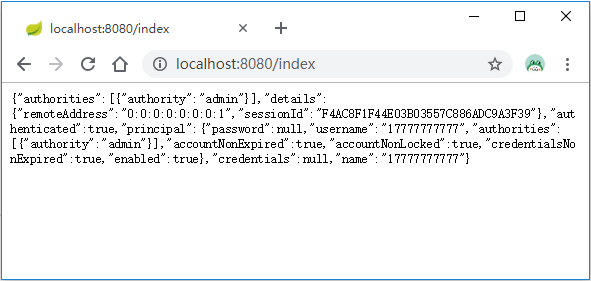

# Spring Security短信验证码登录
在Spring Security添加图形验证码一节中，我们已经实现了基于Spring Boot + Spring Security的账号密码登录，并集成了图形验证码功能。时下另一种非常常见的网站登录方式为手机短信验证码登录，但Spring Security默认只提供了账号密码的登录认证逻辑，所以要实现手机短信验证码登录认证功能，我们需要模仿Spring Security账号密码登录逻辑代码来实现一套自己的认证逻辑。
# 短信验证码生成
我们在上一节Spring Security添加图形验证码的基础上来集成短信验证码登录的功能。

和图形验证码类似，我们先定义一个短信验证码对象SmsCode：

```java
public class SmsCode {

    private String code;
    private LocalDateTime expireTime;

    public SmsCode(String code, int expireIn) {
        this.code = code;
        this.expireTime = LocalDateTime.now().plusSeconds(expireIn);
    }

    public SmsCode(String code, LocalDateTime expireTime) {
        this.code = code;
        this.expireTime = expireTime;
    }

    boolean isExpire() {
        return LocalDateTime.now().isAfter(expireTime);
    }
    // get,set 略
}
```
SmsCode对象包含了两个属性：code验证码和expireTime过期时间。isExpire方法用于判断短信验证码是否已过期。

接着在ValidateCodeController中加入生成短信验证码相关请求对应的方法：
```java
package com.zipeng.web.controller;

import com.zipeng.validate.code.ImageCode;
import com.zipeng.validate.smscode.SmsCode;
import org.apache.commons.lang3.RandomStringUtils;
import org.springframework.social.connect.web.HttpSessionSessionStrategy;
import org.springframework.social.connect.web.SessionStrategy;
import org.springframework.web.bind.annotation.GetMapping;
import org.springframework.web.bind.annotation.RestController;
import org.springframework.web.context.request.ServletWebRequest;

import javax.imageio.ImageIO;
import javax.servlet.http.HttpServletRequest;
import javax.servlet.http.HttpServletResponse;
import java.awt.*;
import java.awt.image.BufferedImage;
import java.io.IOException;
import java.util.Random;

@RestController
public class ValidateController {
    public final static String SESSION_KEY_SMS_CODE = "SESSION_KEY_SMS_CODE";

    private SessionStrategy sessionStrategy = new HttpSessionSessionStrategy();
    
    @GetMapping("/code/sms")
    public void createSmsCode(HttpServletRequest request, HttpServletResponse response, String mobile) {
        SmsCode smsCode = createSMSCode();
        sessionStrategy.setAttribute(new ServletWebRequest(request), SESSION_KEY_SMS_CODE + mobile, smsCode);
        // 输出验证码到控制台代替短信发送服务
        System.out.println("您的手机号码为：" + mobile);
        System.out.println("您的登陆验证码为：" + smsCode.getCode() + "，有效时间为60秒");
    }

    private SmsCode createSMSCode() {
        String code = RandomStringUtils.randomNumeric(6);
        return new SmsCode(code, 60);
    }

}
```
这里我们使用createSMSCode方法生成了一个6位的纯数字随机数，有效时间为60秒。然后通过SessionStrategy对象的setAttribute方法将短信验证码保存到了Session中，对应的key为SESSION_KEY_SMS_CODE。

至此，短信验证码生成模块编写完毕，下面开始改造登录页面。

# 改造登录页
我们在登录页面中加入一个与手机短信验证码认证相关的Form表单：
```html
<head>
    <script src="//ajax.aspnetcdn.com/ajax/jQuery/jquery-1.8.3.min.js"></script>
</head>
<form class="login-page" action="/login/mobile" method="post">
    <div class="form">
        <h3>短信验证码登录</h3>
        <input id="mobile" type="text" name="mobile" placeholder="请输入手机号" required="required"/>
        <span style="display: inline">
            <input type="text" name="smsCode" placeholder="请输入验证码" style="width: 50%;"/>
            <a onclick="" href="javascript: void(displayDate())">发送验证码</a>
        </span>
        <button type="submit">登录</button>
    </div>
</form>

<script>
    function displayDate() {
        var mobile = $('#mobile').val();
        window.location.href = "/code/sms?mobile=" + mobile;
    }
</script>
```
其中a标签的href属性值对应我们的短信验证码生成方法的请求URL。Form的action对应处理短信验证码登录方法的请求URL，这个方法下面在进行具体实现。同时，我们需要在Spring Security中配置/code/sms路径免验证：
```java
package com.zipeng.security.browser;

import com.zipeng.handler.MyAuthenticationFailureHandler;
import com.zipeng.handler.MyAuthenticationSucessHandler;
import com.zipeng.validate.code.ValidateCodeFilter;
import com.zipeng.validate.smscode.SmsAuthenticationConfig;
import com.zipeng.validate.smscode.SmsCodeFilter;
import org.springframework.beans.factory.annotation.Autowired;
import org.springframework.context.annotation.Bean;
import org.springframework.context.annotation.Configuration;
import org.springframework.security.config.annotation.web.builders.HttpSecurity;
import org.springframework.security.config.annotation.web.configuration.WebSecurityConfigurerAdapter;
import org.springframework.security.crypto.bcrypt.BCryptPasswordEncoder;
import org.springframework.security.crypto.password.PasswordEncoder;
import org.springframework.security.web.authentication.UsernamePasswordAuthenticationFilter;

@Configuration
public class BrowserSecurityConfig extends WebSecurityConfigurerAdapter {
    @Override
    protected void configure(HttpSecurity http) throws Exception {
        http.addFilterBefore(validateCodeFilter, UsernamePasswordAuthenticationFilter.class) // 添加验证码校验过滤器
                .formLogin() // 表单登录
                // http.httpBasic() // HTTP Basic
                .loginPage("/authentication/require") // 登录跳转 URL
                .loginProcessingUrl("/login") // 处理表单登录 URL
                .successHandler(authenticationSucessHandler) // 处理登录成功
                .failureHandler(authenticationFailureHandler) // 处理登录失败
                .and()
                .authorizeRequests() // 授权配置
                .antMatchers("/authentication/require",
                        "/login.html",
                        "/code/image",
                        "/code/sms").permitAll() // 无需认证的请求路径
                .anyRequest()  // 所有请求
                .authenticated() // 都需要认证
                .and().csrf().disable();
    }

}
```
重启项目，访问http://localhost:8080/login.html：



点击发送验证码，控制台输出如下：
```text
您的手机号码为：13318030996
您的登陆验证码为：241395，有效时间为60秒
```
接下来开始实现使用短信验证码登录认证逻辑。

# 添加短信验证码认证
在Spring Security中，使用用户名密码认证的过程大致如下图所示：



Spring Security使用UsernamePasswordAuthenticationFilter过滤器来拦截用户名密码认证请求，将用户名和密码封装成一个UsernamePasswordToken对象交给AuthenticationManager处理。AuthenticationManager将挑出一个支持处理该类型Token的AuthenticationProvider（这里为DaoAuthenticationProvider，AuthenticationProvider的其中一个实现类）来进行认证，认证过程中DaoAuthenticationProvider将调用UserDetailService的loadUserByUsername方法来获取UserDetails对象，如果UserDetails不为空并且密码和用户输入的密码匹配一致的话，则将认证信息保存到Session中，认证后我们便可以通过Authentication对象获取到认证的信息了。

由于Spring Security并没用提供短信验证码认证的流程，所以我们需要仿照上面这个流程来实现：



在这个流程中，我们自定义了一个名为SmsAuthenticationFitler的过滤器来拦截短信验证码登录请求，并将手机号码封装到一个叫SmsAuthenticationToken的对象中。在Spring Security中，认证处理都需要通过AuthenticationManager来代理，所以这里我们依旧将SmsAuthenticationToken交由AuthenticationManager处理。接着我们需要定义一个支持处理SmsAuthenticationToken对象的SmsAuthenticationProvider，SmsAuthenticationProvider调用UserDetailService的loadUserByUsername方法来处理认证。与用户名密码认证不一样的是，这里是通过SmsAuthenticationToken中的手机号去数据库中查询是否有与之对应的用户，如果有，则将该用户信息封装到UserDetails对象中返回并将认证后的信息保存到Authentication对象中。

为了实现这个流程，我们需要定义SmsAuthenticationFitler、SmsAuthenticationToken和SmsAuthenticationProvider，并将这些组建组合起来添加到Spring Security中。下面我们来逐步实现这个过程。

## 定义SmsAuthenticationToken

查看UsernamePasswordAuthenticationToken的源码，将其复制出来重命名为SmsAuthenticationToken，并稍作修改，修改后的代码如下所示：

```java
public class SmsAuthenticationToken extends AbstractAuthenticationToken {
    
    private static final long serialVersionUID = SpringSecurityCoreVersion.SERIAL_VERSION_UID;

    private final Object principal;

    public SmsAuthenticationToken(String mobile) {
        super(null);
        this.principal = mobile;
        setAuthenticated(false);
    }

    public SmsAuthenticationToken(Object principal, Collection<? extends GrantedAuthority> authorities) {
        super(authorities);
        this.principal = principal;
        super.setAuthenticated(true); // must use super, as we override
    }

    @Override
    public Object getCredentials() {
        return null;
    }

    @Override
    public Object getPrincipal() {
        return this.principal;
    }

    @Override
    public void setAuthenticated(boolean isAuthenticated) throws IllegalArgumentException {
        if (isAuthenticated) {
            throw new IllegalArgumentException(
                    "Cannot set this token to trusted - use constructor which takes a GrantedAuthority list instead");
        }

        super.setAuthenticated(false);
    }

    @Override
    public void eraseCredentials() {
        super.eraseCredentials();
    }

}
```
SmsAuthenticationToken包含一个principal属性，从它的两个构造函数可以看出，在认证之前principal存的是手机号，认证之后存的是用户信息。UsernamePasswordAuthenticationToken原来还包含一个credentials属性用于存放密码，这里不需要就去掉了。

## 定义SmsAuthenticationFilter
定义完SmsAuthenticationToken后，我们接着定义用于处理短信验证码登录请求的过滤器SmsAuthenticationFilter，同样的复制UsernamePasswordAuthenticationFilter源码并稍作修改：
```java
public class SmsAuthenticationFilter extends AbstractAuthenticationProcessingFilter {

    public static final String MOBILE_KEY = "mobile";

    private String mobileParameter = MOBILE_KEY;
    private boolean postOnly = true;

    public SmsAuthenticationFilter() {
        super(new AntPathRequestMatcher("/login/mobile", "POST"));
    }

    @Override
    public Authentication attemptAuthentication(HttpServletRequest request,
                                                HttpServletResponse response) throws AuthenticationException {
        if (postOnly && !request.getMethod().equals("POST")) {
            throw new AuthenticationServiceException(
                    "Authentication method not supported: " + request.getMethod());
        }

        String mobile = obtainMobile(request);

        if (mobile == null) {
            mobile = "";
        }

        mobile = mobile.trim();

        SmsAuthenticationToken authRequest = new SmsAuthenticationToken(mobile);

        setDetails(request, authRequest);

        return this.getAuthenticationManager().authenticate(authRequest);
    }

    protected String obtainMobile(HttpServletRequest request) {
        return request.getParameter(mobileParameter);
    }

    protected void setDetails(HttpServletRequest request,
                              SmsAuthenticationToken authRequest) {
        authRequest.setDetails(authenticationDetailsSource.buildDetails(request));
    }

    public void setMobileParameter(String mobileParameter) {
        Assert.hasText(mobileParameter, "mobile parameter must not be empty or null");
        this.mobileParameter = mobileParameter;
    }

    public void setPostOnly(boolean postOnly) {
        this.postOnly = postOnly;
    }

    public final String getMobileParameter() {
        return mobileParameter;
    }
}
```
构造函数中指定了当请求为/login/mobile，请求方法为POST的时候该过滤器生效。mobileParameter属性值为mobile，对应登录页面手机号输入框的name属性。attemptAuthentication方法从请求中获取到mobile参数值，并调用SmsAuthenticationToken的SmsAuthenticationToken(String mobile)构造方法创建了一个SmsAuthenticationToken。下一步就如流程图中所示的那样，SmsAuthenticationFilter将SmsAuthenticationToken交给AuthenticationManager处理。

## 定义SmsAuthenticationProvider
在创建完SmsAuthenticationFilter后，我们需要创建一个支持处理该类型Token的类，即SmsAuthenticationProvider，该类需要实现AuthenticationProvider的两个抽象方法：
```java
public class SmsAuthenticationProvider implements AuthenticationProvider {

    private UserDetailService userDetailService;

    @Override
    public Authentication authenticate(Authentication authentication) throws AuthenticationException {
        SmsAuthenticationToken authenticationToken = (SmsAuthenticationToken) authentication;
        UserDetails userDetails = userDetailService.loadUserByUsername((String) authenticationToken.getPrincipal());

        if (userDetails == null) {
            throw new InternalAuthenticationServiceException("未找到与该手机号对应的用户");
        }

        SmsAuthenticationToken authenticationResult = new SmsAuthenticationToken(userDetails, userDetails.getAuthorities());

        authenticationResult.setDetails(authenticationToken.getDetails());

        return authenticationResult;
    }

    @Override
    public boolean supports(Class<?> aClass) {
        return SmsAuthenticationToken.class.isAssignableFrom(aClass);
    }

    public UserDetailService getUserDetailService() {
        return userDetailService;
    }

    public void setUserDetailService(UserDetailService userDetailService) {
        this.userDetailService = userDetailService;
    }
}
```
其中supports方法指定了支持处理的Token类型为SmsAuthenticationToken，authenticate方法用于编写具体的身份认证逻辑。在authenticate方法中，我们从SmsAuthenticationToken中取出了手机号信息，并调用了UserDetailService的loadUserByUsername方法。该方法在用户名密码类型的认证中，主要逻辑是通过用户名查询用户信息，如果存在该用户并且密码一致则认证成功；而在短信验证码认证的过程中，该方法需要通过手机号去查询用户，如果存在该用户则认证通过。认证通过后接着调用SmsAuthenticationToken的SmsAuthenticationToken(Object principal, Collection<? extends GrantedAuthority> authorities)构造函数构造一个认证通过的Token，包含了用户信息和用户权限。

你可能会问，为什么这一步没有进行短信验证码的校验呢？实际上短信验证码的校验是在SmsAuthenticationFilter之前完成的，即只有当短信验证码正确以后才开始走认证的流程。所以接下来我们需要定一个过滤器来校验短信验证码的正确性。

## 定义SmsCodeFilter
短信验证码的校验逻辑其实和图形验证码的校验逻辑基本一致，所以我们在图形验证码过滤器的基础上稍作修改，代码如下所示：
```java
@Component
public class SmsCodeFilter extends OncePerRequestFilter {

    @Autowired
    private AuthenticationFailureHandler authenticationFailureHandler;

    private SessionStrategy sessionStrategy = new HttpSessionSessionStrategy();

    @Override
    protected void doFilterInternal(HttpServletRequest httpServletRequest, HttpServletResponse httpServletResponse, FilterChain filterChain) throws ServletException, IOException {
        if (StringUtils.equalsIgnoreCase("/login/mobile", httpServletRequest.getRequestURI())
                && StringUtils.equalsIgnoreCase(httpServletRequest.getMethod(), "post")) {
            try {
                validateCode(new ServletWebRequest(httpServletRequest));
            } catch (ValidateCodeException e) {
                authenticationFailureHandler.onAuthenticationFailure(httpServletRequest, httpServletResponse, e);
                return;
            }
        }
        filterChain.doFilter(httpServletRequest, httpServletResponse);
    }

    private void validateCode(ServletWebRequest servletWebRequest) throws ServletRequestBindingException {
        String smsCodeInRequest = ServletRequestUtils.getStringParameter(servletWebRequest.getRequest(), "smsCode");
        String mobileInRequest = ServletRequestUtils.getStringParameter(servletWebRequest.getRequest(), "mobile");

        SmsCode codeInSession = (SmsCode) sessionStrategy.getAttribute(servletWebRequest, ValidateController.SESSION_KEY_SMS_CODE + mobileInRequest);

        if (StringUtils.isBlank(smsCodeInRequest)) {
            throw new ValidateCodeException("验证码不能为空！");
        }
        if (codeInSession == null) {
            throw new ValidateCodeException("验证码不存在！");
        }
        if (codeInSession.isExpire()) {
            sessionStrategy.removeAttribute(servletWebRequest, ValidateController.SESSION_KEY_IMAGE_CODE);
            throw new ValidateCodeException("验证码已过期！");
        }
        if (!StringUtils.equalsIgnoreCase(codeInSession.getCode(), smsCodeInRequest)) {
            throw new ValidateCodeException("验证码不正确！");
        }
        sessionStrategy.removeAttribute(servletWebRequest, ValidateController.SESSION_KEY_IMAGE_CODE);

    }
}
```
方法的基本逻辑和之前定义的ValidateCodeFilter一致，这里不再赘述。

## 配置生效
在定义完所需的组件后，我们需要进行一些配置，将这些组件组合起来形成一个和上面流程图对应的流程。创建一个配置类SmsAuthenticationConfig：
```java
@Component
public class SmsAuthenticationConfig extends SecurityConfigurerAdapter<DefaultSecurityFilterChain, HttpSecurity> {

    @Autowired
    private AuthenticationSuccessHandler authenticationSuccessHandler;

    @Autowired
    private AuthenticationFailureHandler authenticationFailureHandler;

    @Autowired
    private UserDetailService userDetailService;

    @Override
    public void configure(HttpSecurity http) throws Exception {
        SmsAuthenticationFilter smsAuthenticationFilter = new SmsAuthenticationFilter();
        smsAuthenticationFilter.setAuthenticationManager(http.getSharedObject(AuthenticationManager.class));
        smsAuthenticationFilter.setAuthenticationSuccessHandler(authenticationSuccessHandler);
        smsAuthenticationFilter.setAuthenticationFailureHandler(authenticationFailureHandler);

        SmsAuthenticationProvider smsAuthenticationProvider = new SmsAuthenticationProvider();
        smsAuthenticationProvider.setUserDetailService(userDetailService);

        http.authenticationProvider(smsAuthenticationProvider)
                .addFilterAfter(smsAuthenticationFilter, UsernamePasswordAuthenticationFilter.class);

    }
}
```
在流程中第一步需要配置SmsAuthenticationFilter，分别设置了AuthenticationManager、AuthenticationSuccessHandler和AuthenticationFailureHandler属性。这些属性都是来自SmsAuthenticationFilter继承的AbstractAuthenticationProcessingFilter类中。

第二步配置SmsAuthenticationProvider，这一步只需要将我们自个的UserDetailService注入进来即可。

最后调用HttpSecurity的authenticationProvider方法指定了AuthenticationProvider为SmsAuthenticationProvider，并将SmsAuthenticationFilter过滤器添加到了UsernamePasswordAuthenticationFilter后面。

到这里我们已经将短信验证码认证的各个组件组合起来了，最后一步需要做的是配置短信验证码校验过滤器，并且将短信验证码认证流程加入到Spring Security中。在BrowserSecurityConfig的configure方法中添加如下配置：
```java
@Configuration
public class BrowserSecurityConfig extends WebSecurityConfigurerAdapter {

    @Autowired
    private MyAuthenticationSucessHandler authenticationSucessHandler;
    @Autowired
    private MyAuthenticationFailureHandler authenticationFailureHandler;
    @Autowired
    private ValidateCodeFilter validateCodeFilter;
    @Autowired
    private SmsCodeFilter smsCodeFilter;
    @Autowired
    private SmsAuthenticationConfig smsAuthenticationConfig;


    @Bean
    public PasswordEncoder passwordEncoder() {
        return new BCryptPasswordEncoder();
    }

    @Override
    protected void configure(HttpSecurity http) throws Exception {
        http.addFilterBefore(validateCodeFilter, UsernamePasswordAuthenticationFilter.class) // 添加验证码校验过滤器
                .addFilterBefore(smsCodeFilter, UsernamePasswordAuthenticationFilter.class) // 添加短信验证码校验过滤器
                .formLogin() // 表单登录
                // http.httpBasic() // HTTP Basic
                .loginPage("/authentication/require") // 登录跳转 URL
                .loginProcessingUrl("/login") // 处理表单登录 URL
                .successHandler(authenticationSucessHandler) // 处理登录成功
                .failureHandler(authenticationFailureHandler) // 处理登录失败
                .and()
                .authorizeRequests() // 授权配置
                .antMatchers("/authentication/require",
                        "/login.html",
                        "/code/image",
                        "/code/sms").permitAll() // 无需认证的请求路径
                .anyRequest()  // 所有请求
                .authenticated() // 都需要认证
                .and().csrf().disable()
                .apply(smsAuthenticationConfig); // 将短信验证码认证配置加到 Spring Security 中
    }

}
```
具体含义见注释，这里不再赘述。

重启项目，访问http://localhost:8080/login.html，点击发送验证码，控制台输出如下：

```text
您的手机号码为：13318030996
您的登陆验证码为：241395，有效时间为60秒
```

输入该验证码，点击登录后页面如下所示：



认证成功。

源码链接 https://github.com/wuyouzhuguli/SpringAll/tree/master/38.Spring-Security-SmsCode


