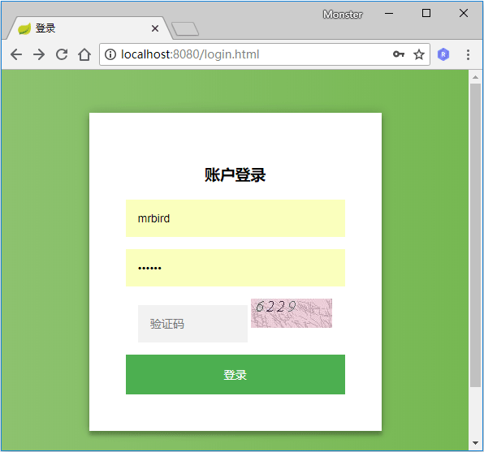
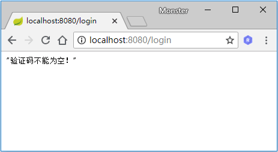
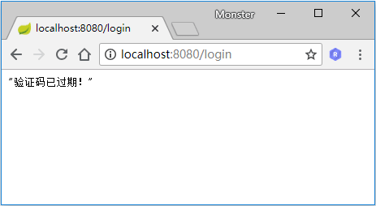
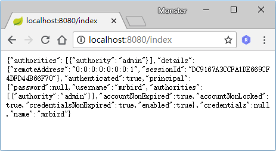

# Spring Security添加图形验证码
添加验证码大致可以分为三个步骤：根据随机数生成验证码图片；将验证码图片显示到登录页面；认证流程中加入验证码校验。Spring Security的认证校验是由UsernamePasswordAuthenticationFilter过滤器完成的，所以我们的验证码校验逻辑应该在这个过滤器之前。下面一起学习下如何在上一节Spring Security自定义用户认证的基础上加入验证码校验功能。

# 生成图形验证码
验证码功能需要用到spring-social-config依赖：
```xml
<!-- https://mvnrepository.com/artifact/org.springframework.social/spring-social-config -->
<dependency>
    <groupId>org.springframework.social</groupId>
    <artifactId>spring-social-config</artifactId>
    <version>1.1.6.RELEASE</version>
</dependency>
```
首先定义一个验证码对象ImageCode：
```java
public class ImageCode {

    private BufferedImage image;

    private String code;

    private LocalDateTime expireTime;

    public ImageCode(BufferedImage image, String code, int expireIn) {
        this.image = image;
        this.code = code;
        this.expireTime = LocalDateTime.now().plusSeconds(expireIn);
    }

    public ImageCode(BufferedImage image, String code, LocalDateTime expireTime) {
        this.image = image;
        this.code = code;
        this.expireTime = expireTime;
    }

    boolean isExpire() {
        return LocalDateTime.now().isAfter(expireTime);
    }
    // get,set 略
}
```
ImageCode对象包含了三个属性：image图片，code验证码和expireTime过期时间。isExpire方法用于判断验证码是否已过期。

接着定义一个ValidateCodeController，用于处理生成验证码请求：
```java
@RestController
public class ValidateController {

    public final static String SESSION_KEY_IMAGE_CODE = "SESSION_KEY_IMAGE_CODE";

    private SessionStrategy sessionStrategy = new HttpSessionSessionStrategy();

    @GetMapping("/code/image")
    public void createCode(HttpServletRequest request, HttpServletResponse response) throws IOException {
        ImageCode imageCode = createImageCode();
        sessionStrategy.setAttribute(new ServletWebRequest(request), SESSION_KEY_IMAGE_CODE, imageCode);
        ImageIO.write(imageCode.getImage(), "jpeg", response.getOutputStream());
    }
}
```
createImageCode方法用于生成验证码对象，org.springframework.social.connect.web.HttpSessionSessionStrategy对象封装了一些处理Session的方法，包含了setAttribute、getAttribute和removeAttribute方法，具体可以查看该类的源码。使用sessionStrategy将生成的验证码对象存储到Session中，并通过IO流将生成的图片输出到登录页面上。

其中createImageCode方法代码如下所示：
```java
private ImageCode createImageCode() {
    int width = 100; // 验证码图片宽度
    int height = 36; // 验证码图片长度
    int length = 4; // 验证码位数
    int expireIn = 60; // 验证码有效时间 60s

    BufferedImage image = new BufferedImage(width, height, BufferedImage.TYPE_INT_RGB);

    Graphics g = image.getGraphics();

    Random random = new Random();

    g.setColor(getRandColor(200, 250));
    g.fillRect(0, 0, width, height);
    g.setFont(new Font("Times New Roman", Font.ITALIC, 20));
    g.setColor(getRandColor(160, 200));
    for (int i = 0; i < 155; i++) {
        int x = random.nextInt(width);
        int y = random.nextInt(height);
        int xl = random.nextInt(12);
        int yl = random.nextInt(12);
        g.drawLine(x, y, x + xl, y + yl);
    }

    StringBuilder sRand = new StringBuilder();
    for (int i = 0; i < length; i++) {
        String rand = String.valueOf(random.nextInt(10));
        sRand.append(rand);
        g.setColor(new Color(20 + random.nextInt(110), 20 + random.nextInt(110), 20 + random.nextInt(110)));
        g.drawString(rand, 13 * i + 6, 16);
    }

    g.dispose();

    return new ImageCode(image, sRand.toString(), expireIn);
}

private Color getRandColor(int fc, int bc) {
    Random random = new Random();
    if (fc > 255){
        fc = 255;
    }
    if (bc > 255){
        bc = 255;
    }
    int r = fc + random.nextInt(bc - fc);
    int g = fc + random.nextInt(bc - fc);
    int b = fc + random.nextInt(bc - fc);
    return new Color(r, g, b);
}
```
生成验证码的方法写好后，接下来开始改造登录页面。

# 改造登录页
在登录页面加上如下代码：
```html
<span style="display: inline">
    <input type="text" name="imageCode" placeholder="验证码" style="width: 50%;"/>
    
</span>
```
标签的src属性对应ValidateController的createImageCode方法。

要使生成验证码的请求不被拦截，需要在BrowserSecurityConfig的configure方法中配置免拦截：
```java
@Override
protected void configure(HttpSecurity http) throws Exception {

    http.formLogin() // 表单登录
            // http.httpBasic() // HTTP Basic
            .loginPage("/authentication/require") // 登录跳转 URL
            .loginProcessingUrl("/login") // 处理表单登录 URL
            .successHandler(authenticationSucessHandler) // 处理登录成功
            .failureHandler(authenticationFailureHandler) // 处理登录失败
            .and()
            .authorizeRequests() // 授权配置
            .antMatchers("/authentication/require",
                    "/login.html",
                    "/code/image").permitAll() // 无需认证的请求路径
            .anyRequest()  // 所有请求
            .authenticated() // 都需要认证
            .and().csrf().disable();
}
```
重启项目，访问http://localhost:8080/login.html，效果如下：



# 认证流程添加验证码校验
在校验验证码的过程中，可能会抛出各种验证码类型的异常，比如“验证码错误”、“验证码已过期”等，所以我们定义一个验证码类型的异常类：
```java
public class ValidateCodeException extends AuthenticationException {
    private static final long serialVersionUID = 5022575393500654458L;

    ValidateCodeException(String message) {
        super(message);
    }
}
```
注意，这里继承的是AuthenticationException而不是Exception。

我们都知道，Spring Security实际上是由许多过滤器组成的过滤器链，处理用户登录逻辑的过滤器为UsernamePasswordAuthenticationFilter，而验证码校验过程应该是在这个过滤器之前的，即只有验证码校验通过后采去校验用户名和密码。由于Spring Security并没有直接提供验证码校验相关的过滤器接口，所以我们需要自己定义一个验证码校验的过滤器ValidateCodeFilter：
```java
@Component
public class ValidateCodeFilter extends OncePerRequestFilter {

    @Autowired
    private AuthenticationFailureHandler authenticationFailureHandler;

    private SessionStrategy sessionStrategy = new HttpSessionSessionStrategy();

    @Override
    protected void doFilterInternal(HttpServletRequest httpServletRequest, HttpServletResponse httpServletResponse, FilterChain filterChain) throws ServletException, IOException {
        if (StringUtils.equalsIgnoreCase("/login", httpServletRequest.getRequestURI())
                && StringUtils.equalsIgnoreCase(httpServletRequest.getMethod(), "post")) {
            try {
                validateCode(new ServletWebRequest(httpServletRequest));
            } catch (ValidateCodeException e) {
                authenticationFailureHandler.onAuthenticationFailure(httpServletRequest, httpServletResponse, e);
                return;
            }
        }
        filterChain.doFilter(httpServletRequest, httpServletResponse);
    }

    private void validateCode(ServletWebRequest servletWebRequest) throws ServletRequestBindingException {
        ...
    }

}
```
ValidateCodeFilter继承了org.springframework.web.filter.OncePerRequestFilter，该过滤器只会执行一次。

在doFilterInternal方法中我们判断了请求URL是否为/login，该路径对应登录form表单的action路径，请求的方法是否为POST，是的话进行验证码校验逻辑，否则直接执行filterChain.doFilter让代码往下走。当在验证码校验的过程中捕获到异常时，调用Spring Security的校验失败处理器AuthenticationFailureHandler进行处理。

validateCode的校验逻辑如下所示：
```java
private void validateCode(ServletWebRequest servletWebRequest) throws ServletRequestBindingException {
    ImageCode codeInSession = (ImageCode) sessionStrategy.getAttribute(servletWebRequest, ValidateController.SESSION_KEY_IMAGE_CODE);
    String codeInRequest = ServletRequestUtils.getStringParameter(servletWebRequest.getRequest(), "imageCode");

    if (StringUtils.isBlank(codeInRequest)) {
        throw new ValidateCodeException("验证码不能为空！");
    }
    if (codeInSession == null) {
        throw new ValidateCodeException("验证码不存在！");
    }
    if (codeInSession.isExpire()) {
        sessionStrategy.removeAttribute(servletWebRequest, ValidateController.SESSION_KEY_IMAGE_CODE);
        throw new ValidateCodeException("验证码已过期！");
    }
    if (!StringUtils.equalsIgnoreCase(codeInSession.getCode(), codeInRequest)) {
        throw new ValidateCodeException("验证码不正确！");
    }
    sessionStrategy.removeAttribute(servletWebRequest, ValidateController.SESSION_KEY_IMAGE_CODE);
}
```
我们分别从Session中获取了ImageCode对象和请求参数imageCode（对应登录页面的验证码<input\>框name属性）,然后进行了各种判断并抛出相应的异常。当验证码过期或者验证码校验通过时，我们便可以删除Session中的ImageCode属性了。

验证码校验过滤器定义好了，怎么才能将其添加到UsernamePasswordAuthenticationFilter前面呢？很简单，只需要在BrowserSecurityConfig的configure方法中添加些许配置即可：
```java
@Autowired
private ValidateCodeFilter validateCodeFilter;

@Override
protected void configure(HttpSecurity http) throws Exception {
    http.addFilterBefore(validateCodeFilter, UsernamePasswordAuthenticationFilter.class) // 添加验证码校验过滤器
            .formLogin() // 表单登录
            // http.httpBasic() // HTTP Basic
            .loginPage("/authentication/require") // 登录跳转 URL
            .loginProcessingUrl("/login") // 处理表单登录 URL
            .successHandler(authenticationSucessHandler) // 处理登录成功
            .failureHandler(authenticationFailureHandler) // 处理登录失败
            .and()
            .authorizeRequests() // 授权配置
            .antMatchers("/authentication/require",
                    "/login.html",
                    "/code/image").permitAll() // 无需认证的请求路径
            .anyRequest()  // 所有请求
            .authenticated() // 都需要认证
            .and().csrf().disable();
}
```
上面代码中，我们注入了ValidateCodeFilter，然后通过addFilterBefore方法将ValidateCodeFilter验证码校验过滤器添加到了UsernamePasswordAuthenticationFilter前面。

大功告成，重启项目，访问http://localhost:8080/login.html，当不输入验证码时点击登录，页面显示如下：



当输入错误的验证码时点击登录，页面显示如下：


当页面加载60秒后再输入验证码点击登录，页面显示如下：



当验证码通过，并且用户名密码正确时，页面显示如下：



源码链接 https://github.com/wuyouzhuguli/SpringAll/tree/master/36.Spring-Security-ValidateCode


